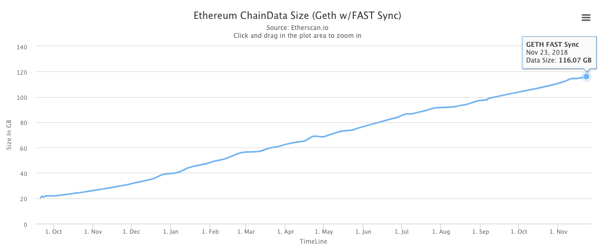
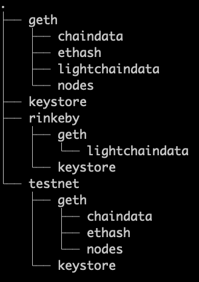
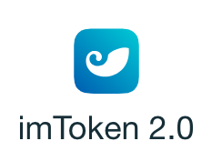

# 一、以太坊简介 About Ethereum

## 以太坊基本概念

> Ethereum is a decentralized platform that runs smart contracts: applications that run exactly as programmed without any possibility of downtime, censorship, fraud or third-party interference.

以太坊是一个去中心化的智能合约运行平台。智能合约是一种只会按预期运行的、永不宕机、没有审查和欺诈的、第三方干涉的应用程序。（参考以太坊官网：https://ethereum.org/。）

## 客户端&节点

以太坊节点的硬盘空间现在是120G（见 https://etherscan.io/chart2/chaindatasizefast ），因此一般的电脑很难同步，也没办法存这么大的文件。

## 帐户(私钥、公钥)

## 网络
- Mainnet
- Testnet
    - Ropsten 可挖矿
    - Rinkeby 可领币
## 区块浏览器

https://etherscan.io/

## 余额

## 交易

## HD钱包及助记词

- Ganache https://truffleframework.com/ganache
- imToken https://token.im/download?locale=en-US

## 实战：使用imToken申请帐户（帐户A）
