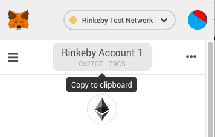

# Rinkeby水龙头

## 水龙头

以太坊 Rinkeby 网络的水龙头 [https://faucet.rinkeby.io/](https://faucet.rinkeby.io/) 是免费领取Ether的网站。用户只需要在社交网站上贴出含有地址的帖子（前后有内容也行），并把网址贴到水龙头，即可领取Ether。领取的频率有8小时、1天、3天，非常方便。

## 领取Ether

领取Ether时，首先拷贝自己的账户地址到社交网络（支持Twitter、Facebook、Google+）。比如我是从MetaMask钱包拷贝。

放到Twitter上

拷贝该条推特地址（如[https://twitter.com/XingAlexander/status/1073119030494429184](https://twitter.com/XingAlexander/status/1073119030494429184)）到水龙头

然后选择想要的个数，一次领的越多，自然就需要间隔的时间越长。我一般比较偷懒，一次领18.75个。常用开发的话，基本都是够用的。  

页面提示成功后，可以立刻在[Etherscan](https://rinkeby.etherscan.io)上查到。我这次的交易是[https://rinkeby.etherscan.io/tx/0xec51272d725beada21486c86a44cb8f580921b94cd196caf20d83cb1e08732bb](https://rinkeby.etherscan.io/tx/0xec51272d725beada21486c86a44cb8f580921b94cd196caf20d83cb1e08732bb)。

同时如果查看MetaMask钱包，也会发现Ether已经到账。

