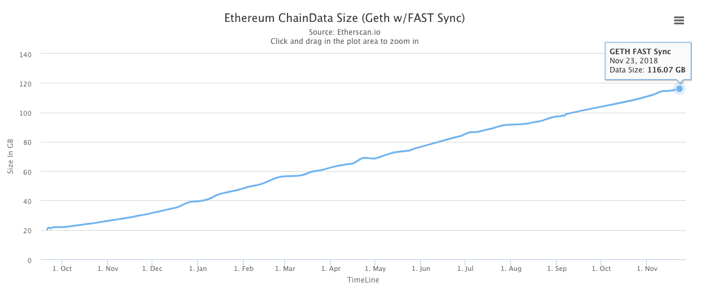
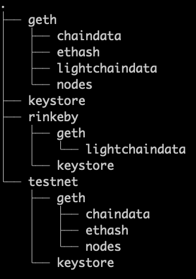
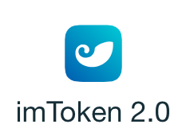

# 以太坊介绍

## 比特币&区块链

## 

#### 比特币

一种点对点电子现金系统。

#### 区块链

* 匿名
* 信息公开
* 不可篡改
* 去中心化

### 以太坊

> Ethereum is a decentralized platform that runs smart contracts: applications that run exactly as programmed without any possibility of downtime, censorship, fraud or third-party interference.

以太坊是一个去中心化的智能合约运行平台。智能合约是一种只会按预期运行的、永不宕机、没有审查和欺诈的、第三方干涉的应用程序。（参考以太坊官网：[https://ethereum.org/。）](https://ethereum.org/。）)

### 客户端&节点

以太坊节点的硬盘空间现在是120G（见 [https://etherscan.io/chart2/chaindatasizefast](https://etherscan.io/chart2/chaindatasizefast) ），因此一般的电脑很难同步，也没办法存这么大的文件。



#### 安装Geth

[https://github.com/ethereum/go-ethereum/wiki/Building-Ethereum](https://github.com/ethereum/go-ethereum/wiki/Building-Ethereum)

### 帐户\(私钥、公钥\)

#### 管理账户

详见官方文档 [https://github.com/ethereum/go-ethereum/wiki/Managing-your-accounts](https://github.com/ethereum/go-ethereum/wiki/Managing-your-accounts)

```bash
$ geth account new
INFO [12-01|14:47:10] Maximum peer count                       ETH=25 LES=0 total=25
Your new account is locked with a password. Please give a password. Do not forget this password.
Passphrase:
Repeat passphrase:
Address: {d2469e98cb024b244a43e027501d1d08404061cb}
$ geth account list
INFO [12-01|14:54:08] Maximum peer count                       ETH=25 LES=0 total=25
Account #0: {d2469e98cb024b244a43e027501d1d08404061cb} keystore:///Users/alex/Library/Ethereum/keystore/UTC--2018-12-01T06-47-40.901497659Z--d2469e98cb024b244a43e027501d1d08404061cb
```

#### 账户目录结构



### 网络

* Mainnet
* Testnet
  * Ropsten 可挖矿
  * Rinkeby 可领币

### 区块浏览器

[https://etherscan.io/](https://etherscan.io/)

### 余额

### 交易

### HD钱包及助记词

* Ganache [https://truffleframework.com/ganache](https://truffleframework.com/ganache)
* imToken2.0 [https://token.im/download?locale=en-US](https://token.im/download?locale=en-US)



### 插件钱包

* MyEtherWallet
  * 简介 [https://kb.myetherwallet.com/getting-started/getting-started-new.html](https://kb.myetherwallet.com/getting-started/getting-started-new.html)
* MetaMask

### 实战：使用imToken申请帐户（帐户A）

下载imToken2.0钱包，并获得一个以太坊账户（ETH账户）。

